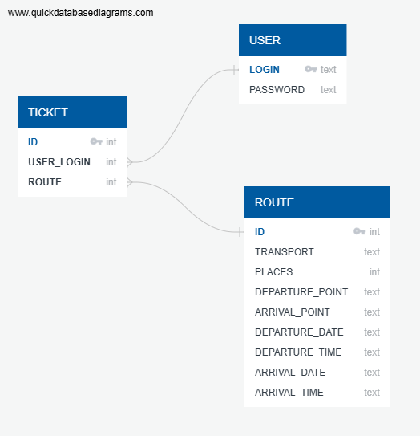

# transportation-service
## Содержание
- [Описание проекта](#описание-проекта)
- [Сборка и запуск проекта](#сборка-и-запуск-проекта)
- [Стек технологий](#стек-технологий)
- [Структура базы данных](#структура-базы-данных)
- [Архитектура проекта](#архитектура-проекта)
- [HTTP-запросы](#http-запросы)
- [Дополнительно](#дополнительно)

## Описание проекта
Клиент-серверное приложение для маркетплейса пассажирских перевозок.  
Приложение позволяет пользователю просматривать действительные маршруты и информацию о них, а также бронировать билеты при наличии свободных мест.

## Сборка и запуск проекта
Для сборки и заупски серверной части приложения запустите bash-скрипт `start.sh` в корневой директории проекта.  
Для взаимодействия с сервером откройте клиент (сайт) - http://localhost:8080

## Стек технологий
### Сервер
* Java (version 17.0.12)
* Spring Boot (version 3.4.3)
#### Build tool:
* Maven (version 3.9.9)
#### Testing framework:
* JUnit (version 5.11.4)
#### Database:
* SQLite (version 3.49.1)

### Клиент
* HTML5
* CSS3
* JavaScript

## Структура базы данных


## Архитектура проекта
### Frontend
- ```/```: Поиск билетов
- ```/booking```: Бронирование билетов
- ```/registration```: Регистрация пользователей
- ```/ticketList```: Просмотр забронированных билетов
### Backend
#### Сущности
- ```User```: Пользователь
- ```Route```: Маршрут
- ```Ticket```: Билет
#### Контроллеры
- ```SearchRouteController```: Предоставление информации о маршрутах
- ```SignInController```: Авторизация пользователей
- ```SignUpController```: Регистрация пользователей
- ```TicketController```: Бронирование, отмена бронирования и предоставление информации о билетах
#### Сервисы
- ```SearchRouteService```:
- ```SignInService```:
- ```SignUpService```:
- ```TicketService```:
#### Репозитории
- ```SearchRouteRepository``` 
- ```SignInRepository```
- ```SignUpRepository```
- ```TicketRepository```

## HTTP-запросы
#### GET http://localhost:8080/search/getRoute
**Описание:** Получить информацию о маршруте по его ID  
**Параметры запроса (URL):** `?routeId={routeId}` (routeId - целое число)  
**Ответ от сервера в формате JSON (200 OK):**
```
{
    "id": 1,
    "transport": "Авиа",
    "places": 120,
    "departurePoint": "МОСКВА",
    "arrivalPoint": "САНКТ-ПЕТЕРБУРГ",
    "departureDate": "2025-08-28",
    "departureTime": "00:44:25",
    "arrivalDate": "2025-08-29",
    "arrivalTime": "02:49:25"
}
```
#### GET http://localhost:8080/search/getRouteByLogin
**Описание:** Получить список маршрутов по логину пользователя  
**Параметры запроса (URL):** `?userLogin={userLogin}` (userLogin - строка)  
**Ответ от сервера в формате JSON (200 OK):**
```
[
    {
        "id": 4384,
        "transport": "Ж/Д",
        "places": 540,
        "departurePoint": "НИЖНИЙ НОВГОРОД",
        "arrivalPoint": "ВЛАДИМИР",
        "departureDate": "2025-08-20",
        "departureTime": "08:47:42",
        "arrivalDate": "2025-08-21",
        "arrivalTime": "11:10:42"
    },
    {
        "id": 6637,
        "transport": "Ж/Д",
        "places": 540,
        "departurePoint": "ХАБАРОВСК",
        "arrivalPoint": "ВЛАДИВОСТОК",
        "departureDate": "2025-04-08",
        "departureTime": "10:01:58",
        "arrivalDate": "2025-04-11",
        "arrivalTime": "15:02:58"
    }
]
```
#### GET http://localhost:8080/search/custom
**Описание:** Получить список маршрутов на основе заполненных данных о маршруте  
**Параметры запроса (URL):** `?transport={transport}&departurePoint={departurePoint}&arrivalPoint={arrivalPoint}&departureDate={departureDate}&departureTime={departureTime}` (transport, departurePoint, arrivalPoint, departureDate, departureTime - строки)  
**Ответ от сервера в формате JSON (200 OK):**
```
[
    {
        "id": 917,
        "transport": "Автобус",
        "places": 40,
        "departurePoint": "КАЗАНЬ",
        "arrivalPoint": "ОМСК",
        "departureDate": "2025-03-30",
        "departureTime": "12:33:30",
        "arrivalDate": "2025-03-31",
        "arrivalTime": "15:37:30"
    }
]
```
#### GET http://localhost:8080/search/global
**Описание:** Получить список всех маршрутов по дате  
**Параметры запроса (URL):** `?date={date}` (date - строка)  
**Ответ от сервера в формате JSON (200 OK):**
```
[
    {
        "id": 98,
        "transport": "Ж/Д",
        "places": 540,
        "departurePoint": "МОСКВА",
        "arrivalPoint": "СОЧИ",
        "departureDate": "2025-03-15",
        "departureTime": "00:34:47",
        "arrivalDate": "2025-03-17",
        "arrivalTime": "10:03:47"
    }
]
```
#### GET http://localhost:8080/search/getFreePlaces
**Описание:** Получить количество свободных мест маршрута  
**Параметры запроса (URL):** `?routeId={routeId}` (routeId - целое число)
**Ответ от сервера в формате JSON (200 OK):**
```
109
```
#### GET http://localhost:8080/sign_in
**Описание:** Авторизация пользователя  
**Параметры запроса (URL):** `?login={login}&password={password}` (login, password - строки)  
**Ответ от сервера в формате JSON (200 OK):**
```
true
```
#### POST http://localhost:8080/sign_up
**Описание:** Регистрация пользователя  
**Параметры запроса (body):** (login, password - строки)  
```
{
    "login": {login},
    "password": {password}
}
``` 
**Ответ от сервера в формате JSON (200 OK):**
```
true
```
#### POST http://localhost:8080/ticket/book
**Описание:** Забронировать билет  
**Параметры запроса (body):** (id, route - целое число, userLogin - строка)  
```
{
    "id": {id},
    "userLogin": {userLogin},
    "route": {route}
}
```
**Ответ от сервера в формате JSON (200 OK):**
```
true
```
#### GET http://localhost:8080/ticket/cancel
**Описание:** Отменить бронь билета  
**Параметры запроса (URL):** `?ticketId={ticketId}` (ticketId - целое число)  
**Ответ от сервера в формате JSON (200 OK):**
```
true
```

#### GET http://localhost:8080/ticket/getTickets
**Описание:** Получить список забронированных билетов пользователя  
**Параметры запроса (URL):** `?userLogin={userLogin}` (userLogin - строка)
**Ответ от сервера в формате JSON (200 OK):**
```
[
    {
        "id": 50002,
        "userLogin": "niro_bb",
        "route": 1
    }
]
```

## Дополнительно
Согласно поставленной задаче в приложении реализовано два варианта поиска.  
1. Поиск на основе заданных параметров - обязательными для заполнения являются поля "Пункт отправления" и "Пункт прибытия", заполнение остальных полей опционально.  
2. Поиск всех доступных вариантов маршрутов в разбивке по датам и сортировке по времени отправления.

Поскольку в задании речь идет о <u>бронировании</u> билетов, а не об их покупке, такая деталь, как стоимость билетов, была проигнорирована.